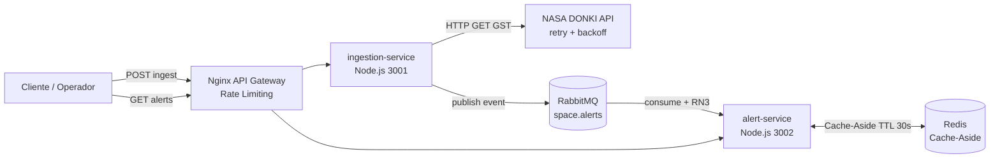

# 🛰️ Solar Shield — Sistema de Monitoramento de Clima Espacial

> **FIAP — Global Solution 2026**
> Disciplina: **Microservice and Web Engineering & IT Services**
> Curso: 3º ano — Sistemas de Informação

Sistema de microsserviços que ingere dados reais da **NASA DONKI** (Database of Notifications, Knowledge, Information), classifica risco de tempestades geomagnéticas e dispara alertas para operadores de infraestrutura crítica (redes elétricas, satélites de comunicação, agronegócio que depende de GPS, etc).

---

## 👥 Integrantes do grupo

|        Nome                   |    RM    |
|-------------------------------|----------|
| Pedro Henrique Lima           |  553664  |
| Maria Alice Sousa Santos      |  552717  |
| Thaís Mari Costa Lopes        |  553620  |

---

## 🏗️ Arquitetura



**Fluxo:**

1. Operador (ou job agendado) faz `POST /api/ingest/gst` no gateway.
2. **ingestion-service** chama a NASA DONKI (`/GST`) com retry + exponential backoff.
3. Para cada evento, aplica a **RN1** (classificação por Kp) e publica em `space.alerts` (RabbitMQ).
4. **alert-service** consome a fila, aplica **RN3** (idempotência por `event_id`) e salva.
5. Operador consulta `GET /api/alerts` — resposta vem do **Redis** (Cache-Aside, TTL 30s).

---

## 📜 Regras de Negócio implementadas

### RN1 — Severidade de tempestade geomagnética (índice Kp)

| Kp | Severity | emergencyNotification |
|----|----------|------------------------|
| ≤ 4 | `low`      | `false` |
| 5–7 | `moderate` | `false` |
| ≥ 8 | `severe`   | `true`  |

📍 Implementação: [`services/ingestion-service/src/classifier.js`](services/ingestion-service/src/classifier.js)
🧪 Testes: [`services/ingestion-service/tests/classifier.test.js`](services/ingestion-service/tests/classifier.test.js)

### RN3 — Idempotência

Eventos com o mesmo `event_id` recebidos mais de uma vez são **descartados**. Cada duplicata gera um log com `event_id` e `detectedAt`. Pode ser consultado em `GET /api/alerts/duplicates`.

📍 Implementação: [`services/alert-service/src/idempotency-store.js`](services/alert-service/src/idempotency-store.js)
🧪 Testes: [`services/alert-service/tests/idempotency.test.js`](services/alert-service/tests/idempotency.test.js)

---

## ⚡ Cache Redis (Cache-Aside) — Justificativa do TTL

**TTL = 30 segundos** no endpoint `GET /api/alerts`.

Tempestades geomagnéticas são eventos esparsos (intervalos de minutos a horas entre observações do DONKI). 30s absorve picos de leitura por dashboards de operadores de infraestrutura crítica sem deixar dados obsoletos a ponto de comprometer decisões operacionais (como reroteamento de tráfego de satélite ou alerta a operadores de rede elétrica). O cache também é **invalidado proativamente** sempre que um novo alerta é consumido da fila — então só se usa o cache "velho" em janelas sem novidades.

---

## 🚀 Como executar

### Pré-requisitos
- Docker + Docker Compose (versão recente, com `docker compose v2`)
- Porta 8080, 5672, 15672 e 6379 livres no host

### Passo a passo

```bash
# 1. Clonar o repositorio
git clone <url-do-repo>
cd solar-shield

# 2. (Opcional) Configurar chave da NASA
cp .env.example .env
# Edite .env e ponha sua chave. Sem editar, usa DEMO_KEY (30 req/h).

# 3. Subir toda a infra
docker compose up --build

# 4. Em outro terminal, validar healthcheck do gateway
curl http://localhost:8080/health
# {"gateway":"ok"}

# 5. Disparar uma ingestao da NASA
curl -X POST http://localhost:8080/api/ingest/gst \
     -H 'Content-Type: application/json' \
     -d '{"startDate":"2024-05-01","endDate":"2024-05-31"}'

# 6. Consultar os alertas (1a vez = MISS, 2a vez = HIT)
curl -i http://localhost:8080/api/alerts
curl -i http://localhost:8080/api/alerts

# Repare no header X-Cache: MISS | HIT

# 7. Ver log de duplicatas (RN3)
curl http://localhost:8080/api/alerts/duplicates
```

### RabbitMQ Management UI
- URL: http://localhost:15672
- User: `solar`  |  Pass: `shield`
- Fila para inspecionar: `space.alerts`

---

## 🧪 Testes

### Testes unitários (Jest)

Cobrem **RN1** (3 cenários) e **RN3** (3 cenários) — total **6 testes**, mais que os 3 exigidos.

```bash
# Ingestion (RN1)
cd services/ingestion-service
npm install
npm test

# Alerts (RN3)
cd ../alert-service
npm install
npm test
```

### Smoke test k6 (10 VUs / 10s)

```bash
# Com Docker (recomendado):
docker run --rm --network host -i grafana/k6 run - < k6/smoke-test.js

# Ou se tiver k6 instalado localmente:
k6 run k6/smoke-test.js
```

Resultado fica salvo em `k6-result.json`.

---

## 🗂️ Estrutura do repositório

```
solar-shield/
├── docker-compose.yml          ← orquestra toda a stack
├── nginx/
│   └── nginx.conf              ← reverse proxy + rate limiting
├── services/
│   ├── ingestion-service/      ← microservico 1
│   │   ├── src/
│   │   │   ├── index.js                 ← API
│   │   │   ├── classifier.js            ← RN1
│   │   │   ├── nasa-client.js           ← retry + backoff
│   │   │   └── rabbitmq-producer.js
│   │   └── tests/classifier.test.js     ← RN1 tests
│   └── alert-service/          ← microservico 2
│       ├── src/
│       │   ├── index.js                 ← API + Cache-Aside
│       │   ├── idempotency-store.js     ← RN3
│       │   ├── alerts-repository.js
│       │   ├── rabbitmq-consumer.js
│       │   └── redis-cache.js
│       └── tests/idempotency.test.js    ← RN3 tests
├── k6/
│   └── smoke-test.js           ← 10 VUs / 10s
└── README.md
```

---

## ✅ Mapeamento dos critérios de avaliação (10 pts)

| # | Critério | Pts | Onde está |
|---|----------|-----|-----------|
| 1 | **Arquitetura de Microsserviços** (2 serviços + Mermaid) | 2.0 | `docker-compose.yml` + diagrama acima |
| 2 | **API Gateway com Nginx** (proxy + rate limiting) | 1.5 | `nginx/nginx.conf` (`limit_req_zone`) |
| 3 | **Comunicação Assíncrona** (RabbitMQ + RN3 idempotência) | 2.0 | `rabbitmq-producer.js` + `rabbitmq-consumer.js` + `idempotency-store.js` |
| 4 | **Cache Redis** (Cache-Aside + TTL justificado) | 1.5 | `redis-cache.js` + justificativa do TTL acima |
| 5 | **Resiliência** (Retry com backoff na NASA) | 1.0 | `nasa-client.js` (`axios-retry`) |
| 6 | **Testes** (3 unitários RN1+RN3 + k6 10 VUs/10s) | 1.5 | `classifier.test.js`, `idempotency.test.js`, `k6/smoke-test.js` |
| 7 | **Entrega** (`docker compose up` funcional + README) | 0.5 | Este README + `docker-compose.yml` |

---

## 🎬 Vídeo Pitch

🔗 https://youtu.be/koZWrq3PH9E?feature=shared
---

## 📚 Referências
- NASA DONKI API: https://api.nasa.gov/
- NOAA Space Weather Scales: https://www.swpc.noaa.gov/noaa-scales-explanation
- RabbitMQ Tutorials: https://www.rabbitmq.com/getstarted.html
- Nginx Rate Limiting: https://www.nginx.com/blog/rate-limiting-nginx/
